# Exercise Behavior Change App
An exercise recommendation app based on behavior change theory.

## Getting Started
* `flutter pub get`
* Generate the Hive adapters - `flutter packages pub run build_runner build`
* `flutter pub run`

## Codebase layout
```
lib/
├── main.dart (entry point)
├── app.dart (MaterialApp configuration)
├── models/
│   ├── user_model.dart
│   └── workout_model.dart
├── screens/
│   ├── auth/
│   │   ├── login_screen.dart
│   │   └── signup_screen.dart
│   ├── onboarding/
│   │   ├── welcome_screen.dart
│   │   ├── demographics_screen.dart
│   │   ├── physical_characteristics_screen.dart
│   │   ├── comorbidities_screen.dart
│   │   ├── goals_screen.dart
│   │   ├── exercise_screen.dart
│   │   ├── preferences_screen.dart
│   │   ├── exercise_location_screen.dart
│   │   └── connect_friends_screen.dart
│   ├── dashboard/
│   │   ├── dashboard_screen.dart
│   │   └── home_screen.dart
│   └── workout/
│       ├── program_details_screen.dart
│       ├── workout_selection_screen.dart
│       ├── workout_screen.dart
│       └── workout_completion_screen.dart
├── widgets/
│   ├── app_button.dart
│   ├── selection_button.dart
│   ├── exercise_card.dart
│   └── achievement_card.dart
├── services/
│   ├── auth_service.dart
│   ├── hive_service.dart
│   └── workout_service.dart
└── utils/
├── constants.dart
├── theme.dart
└── helpers.dart
```

## App codebase principles
1. Single Responsibility Principle: Each file will have a single responsibility
2. Reusable Components: Extract repeated UI patterns into reusable widgets
3. Simplified State Management: Implement proper state management
4. Improved Navigation: Centralize routing
5. Services: Extract business logic into service classes

## Screenshots

The following screenshots walk through a typical user journey in the Exercise Behavior Change App—from launch to workout completion and feedback.

---

### 1. App Launch & Login

| Startup Screen | Login Options | Registration |
|----------------|---------------|--------------|
| 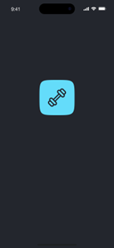 | 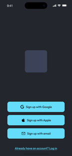 | 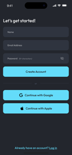 |
| App launch screen with app icon | Sign-up options via Google, Apple, Email | User registration form |

---

### 2. Home & Navigation

| Home Dashboard | Menu Drawer | Settings |
|----------------|-------------|----------|
| 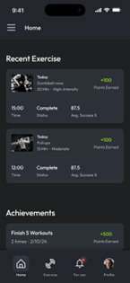 | 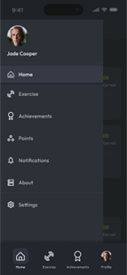 | 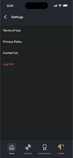 |
| Recent exercises and achievements | App navigation: Home, Exercise, Profile | Terms of use, privacy, contact, logout |

---

### 3. Workout Flow

| Workout Start | Equipment Selection | Workout Scheduler |
|---------------|---------------------|--------------------|
| 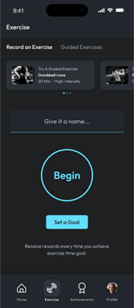 | 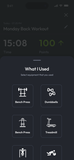 | 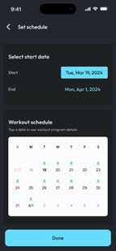 |
| Begin recording exercise and set goals | Log which equipment was used during the session | Set and view your personalized workout calendar |

| Program Details | Workout Summary | Workout Feedback |
|-----------------|------------------|------------------|
| 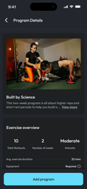 | 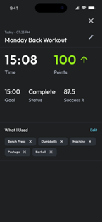 | 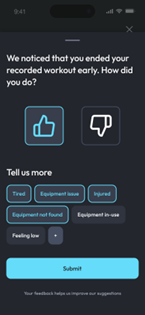 |
| View info about a workout program and add it to your plan | Summary of completed workout with time, success percentage, and equipment used | Rate your session and provide feedback if it ended early |


## Unit Tests
TBD

### App Testing
This project is tested with BrowserStack

## Roadmap
1. Improve the Profile page to add Friends and Connections 
2. Move to Firebase - Auth as well as user data
3. Include recommender system
4. Achievements and Goals that are change over time through user input and recommender system
5. Change settings for reminders and cross-platform device and accessories (Watch, scales, exercise machines)

